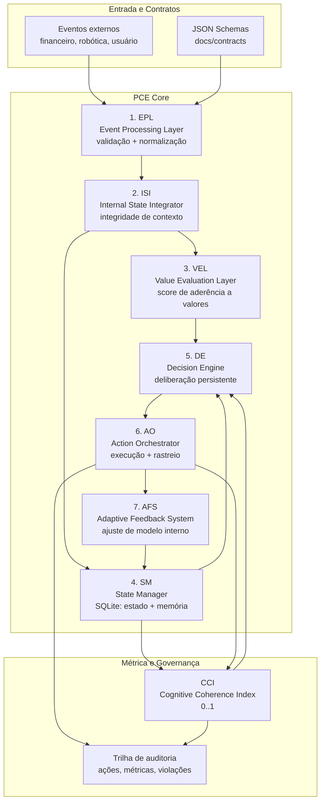

# pce-python-core

Implementação de referência em Python da **Persistent Cognition Engine (PCE)**, orientada ao whitepaper PCE 2026.

> **Tese central (fonte primária):** a PCE formaliza a transição de automação reativa para **deliberação persistente**, de resposta pontual para **responsabilidade estrutural**, e de otimização estatística isolada para **cognição coerente com valores explícitos e memória integrada**, com **CCI (Cognitive Coherence Index)** como métrica proprietária de coerência cognitiva.

## 1) Visão executiva

Sistemas baseados apenas em inferência reativa tendem a:
- otimizar a próxima resposta sem memória causal robusta;
- operar sem compromisso explícito com valores estratégicos;
- dificultar auditoria de decisões ao longo do tempo.

A PCE corrige essas limitações por meio de uma arquitetura de **7 camadas desacopladas**, persistência de estado e telemetria de coerência cognitiva (CCI), criando um ciclo contínuo entre evento, deliberação, execução, feedback e adaptação.

## 2) Princípios técnicos derivados do whitepaper PCE 2026

1. **Persistência cognitiva:** decisões devem depender de histórico estruturado, não apenas do contexto instantâneo.
2. **Responsabilidade estrutural:** cada decisão precisa ser rastreável por contratos, estado, racional e efeitos observados.
3. **Valores explícitos:** alinhamento estratégico é tratado como sinal computável (VEL), não como suposição implícita.
4. **Coerência mensurável:** CCI transforma coerência em variável operacional de controle.
5. **Arquitetura em camadas:** separação de responsabilidades para evolução incremental, validação e governança.

## 3) Arquitetura de referência (7 camadas + feedback CCI)



### Definição operacional do CCI

A métrica CCI (normalizada em [0,1]) combina quatro sinais:

`CCI = wc*consistência + ws*estabilidade + wn*(1 - taxa_contradições) + wp*precisão_preditiva`

Pesos padrão no código atual:
- `wc = 0.35`
- `ws = 0.25`
- `wn = 0.25`
- `wp = 0.15`

## 4) Instalação

### Requisitos
- Python 3.11+
- virtualenv recomendado

### Setup local

```bash
python -m venv .venv
source .venv/bin/activate
pip install -e .[dev]
cp config/.env.example .env
```

## 5) Quickstart: loop de worker + API

### 5.1 Rodar testes e checks mínimos

```bash
pytest -q
ruff check .
mypy src
```

### 5.2 Executar loop contínuo (deliberação persistente)

```bash
python -m worker.loop
```

Saída esperada: linhas com `event`, `action`, `cci_before`, `cci_after`, `value` por iteração.

### 5.3 Subir API

```bash
uvicorn api.main:app --reload
```

Endpoints principais:
- `POST /events`: injeta evento e executa pipeline fim-a-fim;
- `GET /cci`: consulta CCI corrente;
- `GET /state`: estado cognitivo persistido;
- `GET /cci/history`: série histórica de snapshots de coerência.

Exemplo:

```bash
curl -X POST http://127.0.0.1:8000/events \
  -H "Content-Type: application/json" \
  -d '{
    "event_type": "market_signal",
    "source": "risk_feed",
    "payload": {"volatility": 0.73, "drawdown": 0.18}
  }'
```


### 5.4 Configuração OpenRouter (plugin assistant)

Para habilitar o domínio `assistant` via `observation.assistant.v1`, configure:

```bash
export OPENROUTER_API_KEY="<sua-chave>"
export OPENROUTER_MODEL="meta-llama/llama-3.2-3b-instruct:free"
export OPENROUTER_BASE_URL="https://openrouter.ai/api/v1/chat/completions"
export OPENROUTER_TIMEOUT_S="5.0"
# opcionais
export OPENROUTER_HTTP_REFERER="https://seu-app"
export OPENROUTER_X_TITLE="pce-python-engine"
```

Se a chave/modelo estiver ausente ou houver erro de chamada, a API retorna fallback controlado na ação `assistant.reply`.

## 6) Casos de uso reais

### 6.1 Agente financeiro empresarial
- Ingestão de sinais de risco, liquidez e compliance.
- Deliberação entre estabilização, execução de estratégia ou coleta adicional.
- CCI como indicador de governança operacional para comitês de risco.

### 6.2 Robô autônomo
- Eventos sensoriais e contexto operacional contínuo.
- Priorização de segurança, estabilidade e missão por valores explícitos.
- Monitoramento de contradições entre plano previsto e impacto observado.

### 6.3 Agente pessoal
- Memória longitudinal de contexto e preferências explícitas.
- Deliberação multiobjetivo sob restrições de valor definidas pelo usuário.
- Auditoria local de decisões para revisão humana.

## 7) Limitações atuais

1. **Persistência local (SQLite):** adequada para fase inicial; exige estratégia de particionamento para alta concorrência.
2. **CCI base:** derivação atual é robusta para prova de conceito, porém ainda não incorpora calibração por domínio.
3. **Sem conectores nativos de produção:** integrações ROS2/streaming corporativo ainda em roadmap.
4. **Políticas adaptativas conservadoras:** AFS atual prioriza previsibilidade sobre agressividade de adaptação.

## 8) Roadmap (Fase 1 → 3)

### Fase 1 — Fundação operacional
- Contratos de eventos e ações estáveis.
- Pipeline PCE completo com CCI em tempo real.
- Auditoria mínima e documentação de arquitetura.

### Fase 2 — Escala e robustez
- Estratégias de persistência híbrida e particionamento.
- Observabilidade ampliada por camada (latência, taxa de contradição, drift de valor).
- Perfis de valor por domínio (financeiro, robótica, assistente pessoal).

### Fase 3 — Sistema estratégico autônomo
- Deliberação hierárquica multi-horizonte temporal.
- Políticas adaptativas com garantias de segurança e compliance.
- Mecanismos formais de governança de coerência (CCI/SLOs cognitivos).

## 9) Contribuições

Contribuições são bem-vindas, com foco em:
- rigor conceitual e aderência ao whitepaper PCE 2026;
- rastreabilidade de decisões e impacto em coerência cognitiva;
- compatibilidade com contratos e ADRs.

Fluxo recomendado:
1. abrir issue com hipótese técnica e impacto em CCI/valores;
2. propor mudança com testes e documentação;
3. incluir evidências de comportamento (antes/depois) e trade-offs.

## 10) Licença

Este projeto está licenciado sob a licença MIT. Consulte `LICENSE`.
