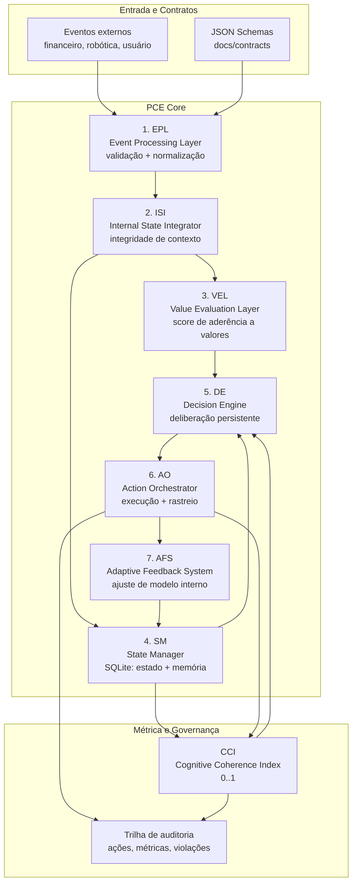

# pce-python-core

Implementação de referência em Python da **Persistent Cognition Engine (PCE)**, orientada ao whitepaper PCE 2026.

> **Tese central (fonte primária):** a PCE formaliza a transição de automação reativa para **deliberação persistente**, de resposta pontual para **responsabilidade estrutural**, e de otimização estatística isolada para **cognição coerente com valores explícitos e memória integrada**, com **CCI (Cognitive Coherence Index)** como métrica proprietária de coerência cognitiva.

## 📘 Documentação principal

Para uma visão consolidada e completa de arquitetura, fluxos e operação do projeto atual, consulte: **`docs/DOCUMENTACAO_PRINCIPAL.md`**.

## 1) Visão executiva

Sistemas baseados apenas em inferência reativa tendem a:
- otimizar a próxima resposta sem memória causal robusta;
- operar sem compromisso explícito com valores estratégicos;
- dificultar auditoria de decisões ao longo do tempo.

A PCE corrige essas limitações por meio de uma arquitetura de **7 camadas desacopladas**, persistência de estado e telemetria de coerência cognitiva (CCI), criando um ciclo contínuo entre evento, deliberação, execução, feedback e adaptação.

## 2) Princípios técnicos derivados do whitepaper PCE 2026

1. **Persistência cognitiva:** decisões devem depender de histórico estruturado, não apenas do contexto instantâneo.
2. **Responsabilidade estrutural:** cada decisão precisa ser rastreável por contratos, estado, racional e efeitos observados.
3. **Valores explícitos:** alinhamento estratégico é tratado como sinal computável (VEL), não como suposição implícita.
4. **Coerência mensurável:** CCI transforma coerência em variável operacional de controle.
5. **Arquitetura em camadas:** separação de responsabilidades para evolução incremental, validação e governança.

## 3) Arquitetura de referência (7 camadas + feedback CCI)



### Definição operacional do CCI

A métrica CCI (normalizada em [0,1]) combina quatro sinais:

`CCI = wc*consistência + ws*estabilidade + wn*(1 - taxa_contradições) + wp*precisão_preditiva`

Pesos padrão no código atual:
- `wc = 0.35`
- `ws = 0.25`
- `wn = 0.25`
- `wp = 0.15`

## 4) Instalação

### Requisitos
- Python 3.11+
- virtualenv recomendado

### Setup local

```bash
python -m venv .venv
source .venv/bin/activate
pip install -e .[dev]
cp config/.env.example .env
```


## 4.1) Rodar localmente no Windows

### Pré-requisitos
- Python **3.11+** (com launcher `py`)
- Git

### Setup oficial (PowerShell)

```powershell
py -3.11 -m venv .venv
.\.venv\Scripts\Activate.ps1
python -m pip install -U pip
pip install -e pce-core -e pce-os -e agents/llm-assistant -e agents/rover
# opcional: instalar extras consolidados
# pip install -r requirements.txt
```

> Se o PowerShell bloquear scripts, execute uma vez (como usuário atual):
>
> `Set-ExecutionPolicy -Scope CurrentUser RemoteSigned`

### Quickstart Windows (5 comandos)

```powershell
py -3.11 -m venv .venv
.\.venv\Scripts\Activate.ps1
python -m pip install -U pip
pip install -e pce-core -e pce-os -e agents/llm-assistant -e agents/rover
uvicorn api.main:app --reload --port 8080
```

### Testes no Windows

```powershell
pytest -q
```

### Demo PCE-OS (Windows)

```powershell
# 1) criar pendência de compra
curl.exe -X POST "http://127.0.0.1:8080/events" -H "Content-Type: application/json" -d '{"event_type":"purchase.requested","source":"os-demo","payload":{"domain":"os.robotics","tags":["purchase"],"projected_cost":120.0,"risk_level":"MEDIUM"}}'
# 2) listar pendências
curl.exe "http://127.0.0.1:8080/os/approvals"
# 3) aprovar e materializar purchase.completed
curl.exe -X POST "http://127.0.0.1:8080/os/approvals/<APPROVAL_ID>/approve" -H "Content-Type: application/json" -d '{"actor":"operator","notes":"ok"}'
# 4) checar twin
curl.exe "http://127.0.0.1:8080/os/robotics/state"
```

## 5) Quickstart: loop de worker + API

### 5.1 Rodar testes e checks mínimos

```bash
pytest -q
ruff check .
mypy src
```

### 5.2 Executar loop contínuo (deliberação persistente)

```bash
python -m worker.loop
```

Saída esperada: linhas com `event`, `action`, `cci_before`, `cci_after`, `value` por iteração.

### 5.3 Subir API

```bash
uvicorn api.main:app --reload
```

Endpoints principais:
- `POST /events`: injeta evento e executa pipeline fim-a-fim;
- `GET /cci`: consulta CCI corrente;
- `GET /state`: estado cognitivo persistido;
- `GET /cci/history`: série histórica de snapshots de coerência.

Exemplo:

```bash
curl -X POST http://127.0.0.1:8000/events \
  -H "Content-Type: application/json" \
  -d '{
    "event_type": "project.goal.defined",
    "source": "pm",
    "payload": {
      "domain": "os.robotics",
      "tags": ["goal"],
      "goal": "launch v1"
    }
  }'
```


### 5.4 Configuração OpenRouter (plugin assistant)

Para habilitar o domínio `assistant` via `observation.assistant.v1`, configure o OpenRouter por **ENV (principal)** ou por **arquivo JSON**.

#### A) Configuração via ENV (principal)

```bash
export OPENROUTER_API_KEY="<sua-chave-openrouter>"
export OPENROUTER_MODEL="meta-llama/llama-3.2-3b-instruct:free"
export OPENROUTER_BASE_URL="https://openrouter.ai/api/v1/chat/completions"
export OPENROUTER_TIMEOUT_S="12"
export OPENROUTER_HTTP_REFERER="https://seu-app"
export OPENROUTER_X_TITLE="pce-python-engine"
```

> Dica: em modelos free, prefira `OPENROUTER_TIMEOUT_S` entre **10 e 15 segundos** para reduzir falsos timeout.

#### B) Configuração via arquivo JSON (`OPENROUTER_CONFIG_PATH`)

```bash
export OPENROUTER_CONFIG_PATH="config/openrouter_credentials.json"
```

Exemplo de arquivo:

```json
{
  "api_key": "<sua-chave-openrouter>",
  "model": "meta-llama/llama-3.2-3b-instruct:free",
  "base_url": "https://openrouter.ai/api/v1/chat/completions",
  "timeout_s": 12.0,
  "http_referer": "https://seu-app",
  "x_title": "pce-python-engine"
}
```

Observações:
- A resolução de configuração ocorre por campo: **ENV > JSON > defaults**.
- `OPENROUTER_CREDENTIALS_FILE` segue aceito por retrocompatibilidade.
- Se não houver chave/modelo válidos, o sistema mantém fallback controlado em `assistant.reply`.

Com esse plugin ativo, a camada de decisão (DE) usa:
- **bandit epsilon-greedy** para escolher perfil (`P0..P3`);
- **override determinístico por VEL+CCI** para modo seguro quando `value_score`/`cci` caem abaixo dos thresholds;
- `metadata.explain.de` com `selected_by_bandit`, `final_profile`, `override_reason`, `final_decoding`, `prompt_hash` e `openrouter_error` quando houver falha.

A adaptação (AFS) agora escreve memória causal por sessão:
- feedback positivo (`reward > 0`) + `notes` atualiza `preferences`;
- feedback negativo (`reward < 0`) + `notes` atualiza `avoid`;
- `preferences` e `avoid` entram no system prompt do próximo turno.

Quando a chamada ao OpenRouter falhar, o fallback de resposta é preservado e o motivo técnico aparece em:
- `metadata.explain.de.openrouter_error` (mensagem curta sanitizada).

Exemplos de payloads:

```json
{
  "event_type": "observation.assistant.v1",
  "source": "assistant-web",
  "payload": {
    "domain": "assistant",
    "session_id": "sessao-123",
    "text": "Me ajude a priorizar tarefas.",
    "tags": ["observation", "assistant"]
  }
}
```

```json
{
  "event_type": "feedback.assistant.v1",
  "source": "assistant-web",
  "payload": {
    "domain": "assistant",
    "session_id": "sessao-123",
    "reward": -1.0,
    "rating": 2,
    "accepted": false,
    "notes": "não seja prolixo"
  }
}
```

#### Troubleshooting OpenRouter

- **401 Unauthorized**: validar `OPENROUTER_API_KEY`, permissões da conta e créditos.
- **429 Too Many Requests**: throttling/rate limit; reduzir frequência de chamadas e adicionar backoff no cliente chamador.
- **400 Bad Request**: geralmente modelo inválido (`OPENROUTER_MODEL`) ou payload fora do formato.
- **Timeout**: aumentar `OPENROUTER_TIMEOUT_S` para 10–15s (especialmente em modelos free).

Nota de runtime: o bridge síncrono (`generate_reply_sync`) é resiliente mesmo com event loop ativo no thread atual, executando a chamada async em thread dedicado quando necessário.


### 5.5 Assistant UI (Vite + React + TypeScript)

Interface web para testar rapidamente o plugin `assistant` sem alterar o backend.

**Requisitos**
- Node.js 18+
- API FastAPI rodando em `http://127.0.0.1:8000` (ou URL definida por `VITE_API_BASE_URL`)

**Como rodar**

1. Suba a API:

```bash
uvicorn pce_api.main:app --reload
```

2. Em outro terminal, suba a UI:

```bash
cd apps/ui-assistant
npm i
npm run dev
```

3. Abra a URL exibida pelo Vite (normalmente `http://127.0.0.1:5173`).

**Proxy `/api` no desenvolvimento**
- A UI chama sempre `/api/events`, `/api/state`, `/api/cci`, `/api/cci/history` e `/api/agents/assistant/control/clear_memory`.
- O Vite faz proxy local para `VITE_API_BASE_URL` e remove o prefixo `/api`.
- Valor padrão: `VITE_API_BASE_URL=http://127.0.0.1:8000`.
- Para alterar: copie `apps/ui-assistant/.env.example` para `.env` e ajuste `VITE_API_BASE_URL`.

**Payload de observação (assistente)**

```json
{
  "event_type": "observation.assistant.v1",
  "source": "assistant-ui",
  "payload": {
    "domain": "assistant",
    "session_id": "local-dev",
    "text": "Explique a diferença entre throughput e latência.",
    "tags": ["observation", "assistant"],
    "context": {"channel": "ui"}
  }
}
```

**Payload de feedback (AFS)**

```json
{
  "event_type": "feedback.assistant.v1",
  "source": "assistant-ui",
  "payload": {
    "domain": "assistant",
    "session_id": "local-dev",
    "reward": -1.0,
    "rating": 2,
    "accepted": false,
    "notes": "não seja prolixo",
    "tags": ["feedback", "assistant"]
  }
}
```


Se a chave/modelo estiver ausente ou houver erro de chamada, a API retorna fallback controlado na ação `assistant.reply`.

## 6) Casos de uso reais

### 6.1 Agente financeiro empresarial
- Ingestão de sinais de risco, liquidez e compliance.
- Deliberação entre estabilização, execução de estratégia ou coleta adicional.
- CCI como indicador de governança operacional para comitês de risco.

### 6.2 Robô autônomo
- Eventos sensoriais e contexto operacional contínuo.
- Priorização de segurança, estabilidade e missão por valores explícitos.
- Monitoramento de contradições entre plano previsto e impacto observado.

### 6.3 Agente pessoal
- Memória longitudinal de contexto e preferências explícitas.
- Deliberação multiobjetivo sob restrições de valor definidas pelo usuário.
- Auditoria local de decisões para revisão humana.

## 7) Limitações atuais

1. **Persistência local (SQLite):** adequada para fase inicial; exige estratégia de particionamento para alta concorrência.
2. **CCI base:** derivação atual é robusta para prova de conceito, porém ainda não incorpora calibração por domínio.
3. **Sem conectores nativos de produção:** integrações ROS2/streaming corporativo ainda em roadmap.
4. **Políticas adaptativas conservadoras:** AFS atual prioriza previsibilidade sobre agressividade de adaptação.

## 8) Roadmap (Fase 1 → 3)

### Fase 1 — Fundação operacional
- Contratos de eventos e ações estáveis.
- Pipeline PCE completo com CCI em tempo real.
- Auditoria mínima e documentação de arquitetura.

### Fase 2 — Escala e robustez
- Estratégias de persistência híbrida e particionamento.
- Observabilidade ampliada por camada (latência, taxa de contradição, drift de valor).
- Perfis de valor por domínio (financeiro, robótica, assistente pessoal).

### Fase 3 — Sistema estratégico autônomo
- Deliberação hierárquica multi-horizonte temporal.
- Políticas adaptativas com garantias de segurança e compliance.
- Mecanismos formais de governança de coerência (CCI/SLOs cognitivos).

## 9) Contribuições

Contribuições são bem-vindas, com foco em:
- rigor conceitual e aderência ao whitepaper PCE 2026;
- rastreabilidade de decisões e impacto em coerência cognitiva;
- compatibilidade com contratos e ADRs.

Fluxo recomendado:
1. abrir issue com hipótese técnica e impacto em CCI/valores;
2. propor mudança com testes e documentação;
3. incluir evidências de comportamento (antes/depois) e trade-offs.

## 10) Licença

Este projeto está licenciado sob a licença MIT. Consulte `LICENSE`.
