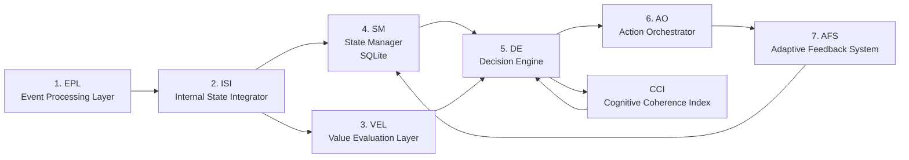

# PCE Architecture Overview

```mermaid
flowchart LR
  EPL[1. EPL\nEvent Processing Layer] --> ISI[2. ISI\nInternal State Integrator]
  ISI --> SM[4. SM\nState Manager\nSQLite]
  ISI --> VEL[3. VEL\nValue Evaluation Layer]
  SM --> DE[5. DE\nDecision Engine]
  VEL --> DE
  DE --> AO[6. AO\nAction Orchestrator]
  AO --> AFS[7. AFS\nAdaptive Feedback System]
  AFS --> SM
  DE --> CCI[CCI\nCognitive Coherence Index]
  CCI --> DE
```

O CCI é calculado continuamente como combinação ponderada de consistência de decisões,
estabilidade de prioridades, não-contradição e precisão preditiva.
