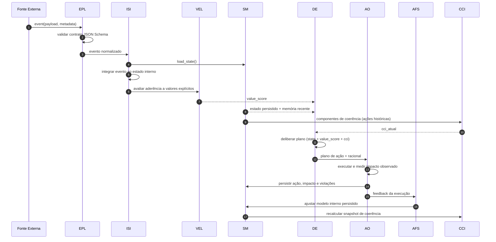

# PCE Architecture Overview

Este documento descreve os fluxos completos da Persistent Cognition Engine (PCE) com foco em deliberação persistente, coerência cognitiva e responsabilidade estrutural.

## 1. Fluxo sistêmico completo com CCI feedback loop

```mermaid
flowchart LR
  E[Evento Externo] --> EPL[1) EPL\nValidação e normalização]
  EPL --> ISI[2) ISI\nIntegração ao estado interno]
  ISI --> VEL[3) VEL\nAvaliação de aderência a valores]
  ISI --> SM[4) SM\nPersistência de estado + memória]
  VEL --> DE[5) DE\nDeliberação de ação]
  SM --> DE
  DE --> AO[6) AO\nExecução orquestrada + rastreio]
  AO --> AFS[7) AFS\nAdaptação do modelo interno]
  AFS --> SM

  SM --> CCI[CCI\nMétrica de coerência 0..1]
  AO --> CCI
  CCI --> DE

  AO --> AUD[Audit Trail\nações + racional + impacto]
  CCI --> AUD
```

### Interpretação operacional do loop

1. **Eventos são validados por contrato** no EPL para eliminar ambiguidade estrutural.
2. **Contexto interno evolui de modo persistente** no ISI e no SM, preservando causalidade histórica.
3. **VEL produz sinal explícito de aderência a valores**, tornando o alinhamento verificável.
4. **DE delibera sob múltiplos sinais**: estado, valor e CCI.
5. **AO executa e registra impacto observado**, fornecendo evidência para auditoria.
6. **AFS ajusta modelo interno** com base em resultados, mantendo continuidade cognitiva.
7. **CCI retroalimenta a deliberação**, criando controle fechado de coerência.

## 2. Diagrama de sequência: deliberação persistente



## 3. Contrato de coerência cognitiva

A derivação base do CCI adota quatro componentes normalizados:

- **Consistência decisória:** proporção de ações que respeitam valores declarados.
- **Estabilidade de prioridade:** variância controlada de urgência entre ações sucessivas.
- **Taxa de contradição:** frequência de violações explícitas de valor.
- **Precisão preditiva:** proximidade entre impacto esperado e impacto observado.

Fórmula:

`CCI = wc*consistência + ws*estabilidade + wn*(1 - contradição) + wp*precisão`

## 4. Glossário

Consulte o glossário em `docs/architecture/glossary.md` para definições normativas de CCI, VEL, ISI e demais termos.
